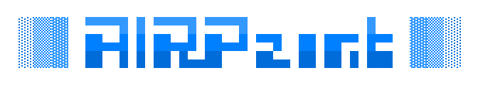

AIRPaint is an ASCII art editor, (heavily) inspired by the excellent
[REXPaint](https://www.gridsagegames.com/rexpaint/index.html). AIRPaint runs in
the browser, so there's nothing to download and it runs on all platforms.

[👉 **Launch AIRPaint**](https://nornagon.github.io/airpaint/)

## Features

- Unlimited canvas size
- Automatically saves all work
- Long undo history
- Draw lines, rectangles and ellipses
- Edit glyph, foreground and background separately
- Unlimited layers
- Copy/paste
- Export and import REXPaint files (.xp)
- Palette editing and management tools

### Planned features

There are [several planned enhancements](https://github.com/nornagon/airpaint/labels/enhancement).
Generally, AIRPaint aims roughly for feature parity with REXPaint, with
modifications to account for the fact that AIRPaint runs in the browser. In
particular, some features that are currently notably missing from AIRPaint are:

- Custom fonts
- Extended fonts (>256 glyphs)
- Export to more formats (CSV, TXT)
- Palette import/export
- Sync to Google Drive / Dropbox / local server
- Lots of keyboard shortcuts from REXPaint are missing
- Multi-layer copy/paste

## Manual

Until AIRPaint gets its own manual, the best guide to AIRPaint is [REXPaint's
manual](https://www.gridsagegames.com/rexpaint/manual.txt). Most things work
similarly in AIRPaint to how they do in REXPaint.
